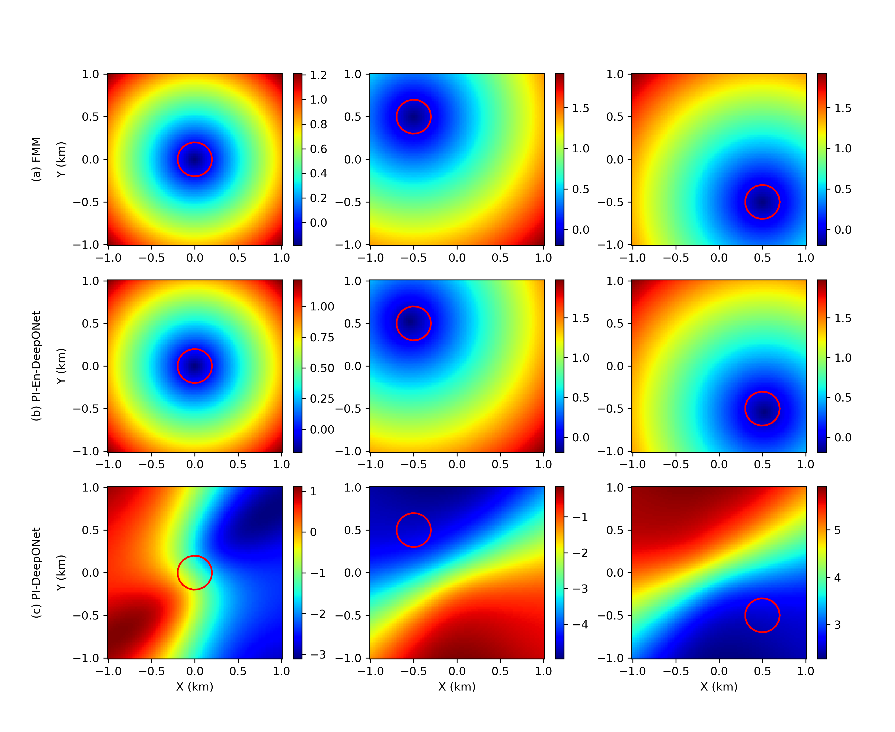

# Circular levelset

Solving the levelset function for a circular shape using enriched DeepONet architecture and comparison against the DeepONet solution.

For more details, [check our paper](https://arxiv.org/abs/2106.01904).
