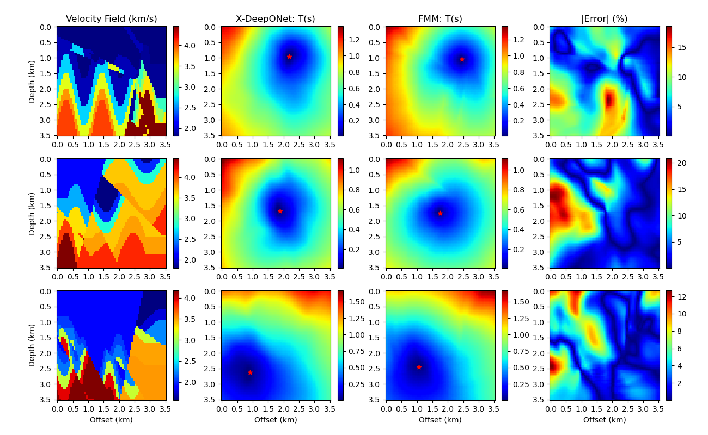

# OpenFWI Velocity Model

Codes for building the neural operator for the OpenFWI dataset.

For more details, [check our paper](https://arxiv.org/abs/2106.01904).

Note: You need to first download the velocity models from [here](https://drive.google.com/drive/folders/1QTDno4_qed94mqhxJRzqWC19iYfANRqD), and revise the `vel_models_path` in the notebooks.

Check [OpenFWI](https://openfwi-lanl.github.io/docs/data.html) for more velocity models.
