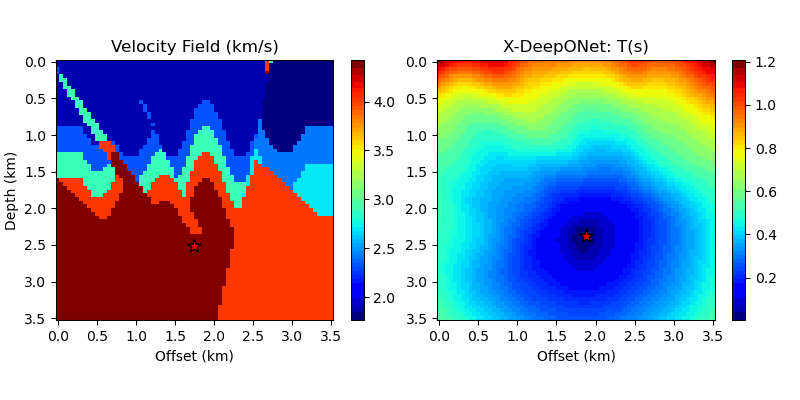

# Enriched DeepONet 
An enrichment approach for enhancing the expressivity of neural operators with applications to seismology

## Abstract:
The Eikonal equation plays a central role in seismic wave propagation and hypocenter localization, a crucial aspect of efficient earthquake early warning systems. Despite recent progress, real-time earthquake localization remains challenging due to the need to learn a generalizable Eikonal operator. We introduce a novel deep learning architecture, Enriched-DeepONet (En-DeepONet), addressing the limitations of current operator learning models in dealing with moving-solution operators. Leveraging addition and subtraction operations and a novel `root' network, En-DeepONet is particularly suitable for learning such operators and achieves up to four orders of magnitude improved accuracy without increased training cost. We demonstrate the effectiveness of En-DeepONet in earthquake localization under variable velocity and arrival time conditions. Our results indicate that En-DeepONet paves the way for real-time hypocenter localization for velocity models of practical interest. 
The proposed method represents a significant advancement in operator learning that is applicable to a gamut of scientific problems, including those in seismology, fracture mechanics, and phase-field problems.




```bibtex
@article{HAGHIGHAT2024116681,
title = {En-DeepONet: An enrichment approach for enhancing the expressivity of neural operators with applications to seismology},
journal = {Computer Methods in Applied Mechanics and Engineering},
volume = {420},
pages = {116681},
year = {2024},
issn = {0045-7825},
doi = {https://doi.org/10.1016/j.cma.2023.116681},
url = {https://www.sciencedirect.com/science/article/pii/S0045782523008046},
arxiv = {https://arxiv.org/abs/2306.04096},
author = {Ehsan Haghighat and Umair bin Waheed and George Karniadakis},
}
```

Data and code related to this work will be shared here.

## Requirements
Tested on `python>=3.8` and `python<=3.10`. Install the requirements using the following command:
```bash
pip install -r requirements.txt
```
